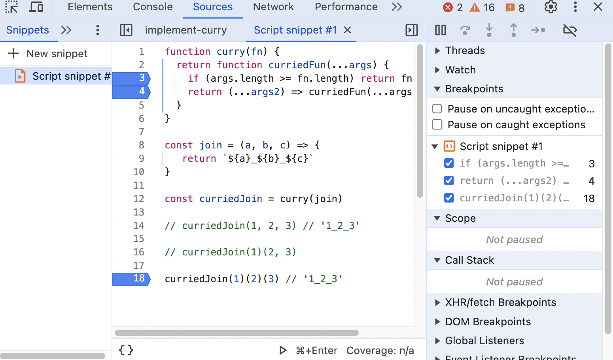

## Question
```javascript
const join = (a, b, c) => {
   return `${a}_${b}_${c}`
}

const curriedJoin = curry(join)

curriedJoin(1, 2, 3) // '1_2_3'

curriedJoin(1)(2, 3) // '1_2_3'

curriedJoin(1, 2)(3) // '1_2_3'
```

## Solution 1
```tsx
function curry(fn) {
  // ...args collects arguments as array (rest)
  return function curriedFunc(...args) {
    // if yes, spread args elements to pass into fn (spread).
    if (args.length >= fn.length) return fn(...args);
    // if not, return a function that collects the next arguments passed in nextArgs and recursively call curriedFunc,
    return (...nextArgs) => curriedFunc(...args, ...nextArgs);
  };
}
```

## Solution 2
```typescript
function curry(func) {
  return function curried(...args) {
    // 1. if enough args, call func 
    // 2. if not enough, bind the args and wait for new one
    if (args.length >= func.length) {
      return func.apply(this, args)
    } else {
      return curried.bind(this, ...args)
    }
  }
}
```

## Note
用 sources run 過一次就很清楚運作流程了。


### What is curry ?
Currying（柯里化），又稱為 partial application 或 partial evaluation，是個
**「將一個接受 n 個參數的 function，轉變成 n 個只接受一個參數的 function」**的過程。

利用 closure 的特性，將傳入 function 的參數，傳入另一個 function 中作為回傳值，這些 function 會形成 chain，待最後參數傳入，完成計算。

優點：
1. 簡化參數處理，一次處理一個參數，提升程式彈性與可讀性。
2. 依功能將程式碼拆成更細的片段，利於重複利用程式碼。


## References
1. [implement curry](https://bigfrontend.dev/problem/implement-curry/discuss)
2. [Currying in JavaScript](https://www.cythilya.tw/2017/02/27/currying-in-javascript/)
3. [第 4 章：Curry（柯里化）](https://jigsawye.gitbooks.io/mostly-adequate-guide/content/ch4.html)
