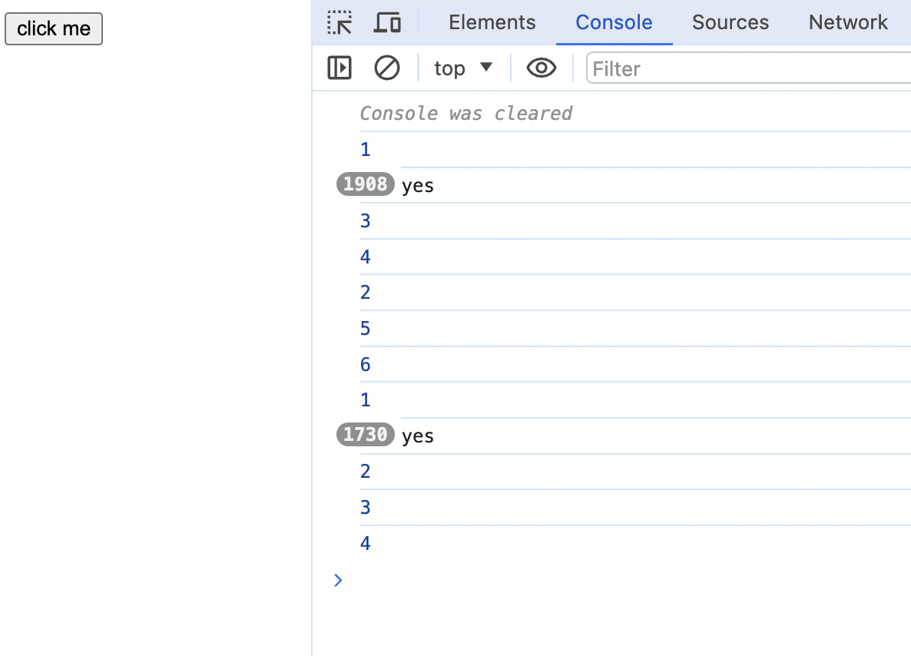

## Question: 0028-useEffect-timing-III
```javascript
'infiniteLoopProtection:false'
import React, { useState, useEffect } from 'react'
import ReactDOM from 'react-dom'
import { screen } from '@testing-library/dom'
import userEvent from '@testing-library/user-event'

function App() {
  const [state, setState] = useState(0)
  console.log(1)
  
  const start = Date.now()
  while (Date.now() - start < 50) {
    window.timestamp = Date.now()
  }

  useEffect(() => {
    console.log(2)
  }, [state])

  Promise.resolve().then(() => console.log(3))

  setTimeout(() => console.log(4), 0)

  const onClick = () => {
    console.log(5)
    setState(num => num + 1)
    console.log(6)
  }
  return <div>
    <button onClick={onClick}>click me</button>
  </div>
}

const root = ReactDOM.createRoot(document.getElementById('root'));
root.render(<App/>)

setTimeout(() => userEvent.click(screen.getByText('click me')), 100)
```

## Solution 1
```tsx
1
3
4
2
5
6
1
2
3
4
```

## Note


The first render, useEffect callback is behind the setTimeout callback, but the second render，the callback executes synchronously.
