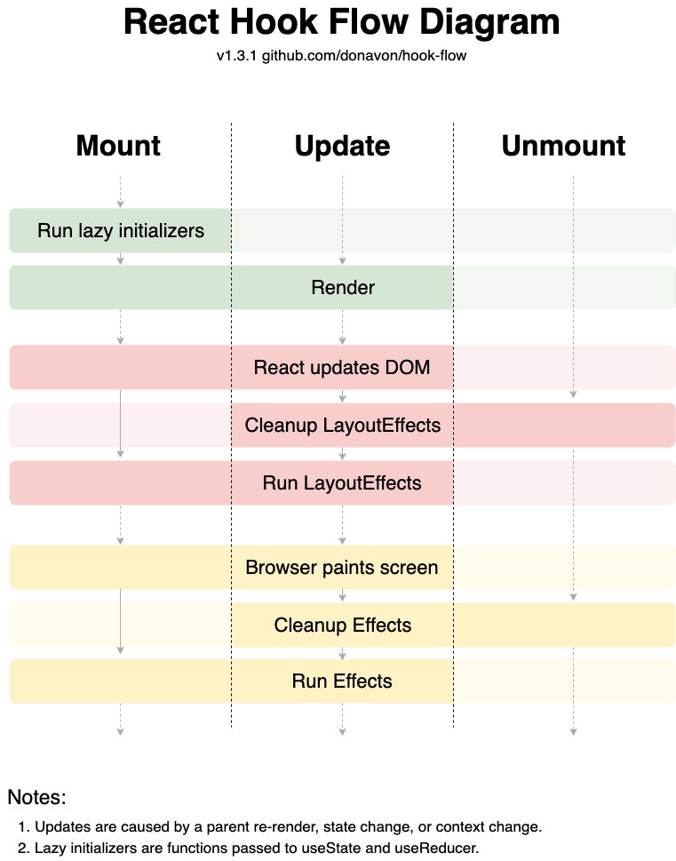

## Question: 0029-useEffect-timing-IV
```javascript
'infiniteLoopProtection:false'

import React, { useState, useEffect, useLayoutEffect} from 'react'
import ReactDOM from 'react-dom'

function App() {
  const [state, setState] = useState(0)
  console.log(1)
  
  const start = Date.now()
  while (Date.now() - start < 50) {
    window.timestamp = Date.now()
  }
  
  useEffect(() => {
    console.log(2)
  }, [state])

  Promise.resolve().then(() => console.log(3))

  setTimeout(() => console.log(4), 0)

  useLayoutEffect(() => {
    console.log(5)
    setState(state => state + 1)
  }, [])

  return null
}

const root = ReactDOM.createRoot(document.getElementById('root'));
root.render(<App/>)
```

## Solution 1
```tsx
1 // initial render
5 // initial useLayoutEffect
2 // initial useEffect
1 // after setState in useLayoutEffect component re-rendered. hence, again 1 is printed
2 // useEffect executed since count changed
3 // resolved promise value on first render
3 // resolved promise value on second render
4 // setTimeout function first render
4 // setTimeout function second render
```

## Note
First layoutEffect is executed then effect is executed. Promise and setTimeout callbacks are added to the task queue and callback queue respectively.


